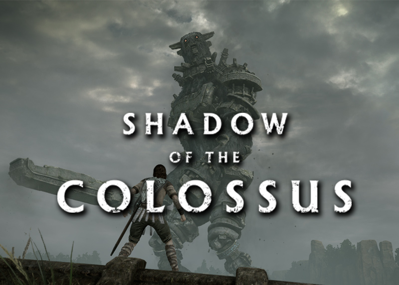

## Index

[**1. Introduction**](/Research-Project-Game-Pillars/#1-introduction)

[**2. Example Games and Pillars**](/Research-Project-Game-Pillars/#2-example-Games-and-pillars)

[**3. RTS Game Pillars**](/Research-Project-Game-Pillars/#3-rts-game-pillars)

[**4. Good and Bad Game Pillars**](/Research-Project-Game-Pillars/#4-good-and-bad-game-pillars)

[**5. Your turn now**](/Research-Project-Game-Pillars/#5-your-turn-now)

[**6. Documentation**](/Research-Project-Game-Pillars/#6-documentation)

## 1. Introduction

I am [Victor Nisa](https://www.linkedin.com/in/victornisa/), student of the [Bachelor’s Degree in Video Games by UPC at CITM](https://www.citm.upc.edu/ing/estudis/graus-videojocs/). This content is generated for the second year’s
subject Project 2, under supervision of lecturer [Ramon Santamaria](https://es.linkedin.com/in/raysan).

When starting to develop a game, designers should start by thinking about the main emotions/ideas it tries to make players feel. It is recommended to have from 3 to 8 game pillars. Having too many pillars will confuse players, and as developers, we can't translate them effectively into emotions. When working as a team, it is recommended to have a set of objectives to accomplish.

Game pillars are the point of reference of game mechanics. In order to make players feel the desired emotions, mechanics that don't revolve around the pillars should be scrapped or, at least, should not be important. 

### Game Design Pillars vs Key Selling Points

First, we need to define what Key Selling Points are. Some game features provide a clear benefit to the player, so communicating those features to the customers can increase the potential number of players.

Although most Game Pillars are Key Selling Points, exposing some Game Pillars can be detrimental for your game. For example, if one of the Game Pillars of a sequel is "Improving bad features from the previous game", it shouldn't become a KSP. Another example of a common hidden Pillar in "Hardcore" games is "accessibility". Their playerbase usually consider accessibility as "making the game easier", thus disliking the game.

## 2. Example Games and Pillars

### Resident Evil 4 (2005)

- **Challenging:** Resident Evil 4 has a steep but flexible difficulty curve. By having adaptive difficulty, the game is always hard, but fair. A limited amount of ammo, few safe spots and an upgrade system are well-balanced elements that make the game challenging. 

- **Simple story:** As many horror games do, Resident Evil 4 keeps an easy to understand story so new players don't get confused, and players who aren't interested on it won't find it intrusive. However, there are references for people who have played the previous games.

- **Dynamic:** The game broke the stereotype for survival horror that "combat is de-emphasized". Levels are filled with interactive elements like kickable ladders, barricable and breakable doors...), enemies have a really good AI for the time (they could be disarmed depending on where you shot them, they ambushed the player and tried to dodge incoming attacks...). 

Developers expect you to die a lot, so there are more than 100 unique ways to die, making the fact of constantly dying a bit less repetitive.

Some fights also combined Third Person Shooter combat with Quick Time Events, making them more dynamic.

### Iconoclasts (2018)

- **Story:** The game has a heavy narrative lead. Almost every NPC could be talked to several times, and the player truly feels that the game world is alive. This Pillar is further emphasized by the next one.
- **Choices:** The main character rarely speaks, but whenever she does, we are able to choose what to say. 

- **Simple tutorial:** To avoid making the player think they're being treated as dumb, the controls are shown at the beginning of the game and from that point onwards, mechanics are learned by paying attention to the environment. (The first image shows the controls tutorial. The next two images show an NPC teaching you how to dodge an attack, and how the player knows they have to rotate their wrench to deflect projectiles by looking at the green particles left by enemies).

- **Exploration:** The game is full of puzzles, some of them optional. Solving them, however, requires a keen eye, as the game is full of hidden rooms. Players who love exploring will be rewarded with collectibles, optional bosses and small bits of lore.

- **Companion:** During a great part of the game, you're accompanied by different partners, even during bossfights. Getting used to having a companion makes the player feel more tense during the parts where the main character is alone.

### Diablo III (2012)

Diablo III has seven main Pillars, as told by Jay Wilson (game director), which are:

- Approachable
- Powerful Heroes
- Highly Customizable
- Great Item Game
- Endlessly Replayable
- Strong Setting
- Cooperative Multiplayer

A survey was given to 3000 Diablo III players to ask which ones were done well. The results were quite interesting, having only 2 Pillars accomplished by the majority of players, according to players.

- Approachable (70% voted YES)
- Powerful Heroes (50% voted YES)
- Strong Setting (25% voted YES)
- Cooperative Multiplayer (20% voted YES)
- Highly Customizable (10% voted YES)
- Endlessly Replayable (10% voted YES)
- Great Item Game (5% voted YES)

It is also remarkable that **only 75 out of the 3000 voters** thought that all Design Pillars were done well, against the 600 votes thinking none were done well).

## 3. RTS Game Pillars

- **Intellectual Challenge:** An RTS should focus on mental calculation rather than physical dexterity. It should also prioritize skill over chance.
- **Clear objective:** The player should know at all times what is their aim. Whether it is an objective as vague as "explore", players should have an idea about their objective.

- **Extensive tutorial:** Most RTS contain complex mechanics, meaning that players should be given a way to understand them.
- **Different unit types:** An RTS with really similar units can be boring. Making really different units (for example, adding rock-paper-scissors mechanics with 3 types of units) can spice the gameplay.

- **Exploration:** The common use of fog of war encourages players to explore and find their objectives rather than rushing them straight up.

## 4. Good and Bad Game Pillars

To understand what is a "good" Game Pillar, we must focus on what can we do as developers. Even if a Game Pillar comes from a great idea, and would really be good in a AAA game, if the developers are University students the Pillar might not make the players feel what is intended. An example would be having "story" as a Game Pillar. AAA games have scriptwriters with many years of experience.

There are, however, "bad" Game Pillars. When you mistakenly have a game mechanic which gives no emotion to players as a Game Pillar, you might start basing the game around a pointless features. It is mandatory to be sure that your Game Pillars are as solid as possible, or else you might find an irreversible error too late into the development cycle.

## 5. Your Turn Now

Think about two examples of good Game Pillars and an example of a bad one of the following games:

Example: Eyes of Heaven

Good Pillars:
- Memorable Characters
- Story mode

Bad Pillars:
- Funny: Although a funny game transfers emotions to players, it is not a good Game Pillar because it is too vague. An improvement could be "make jokes"

- Mario Kart

- Clash Royale

- Shadow of the Colossus

## 6. Documentation

https://www.diabloii.net/blog/comments/diablo-3s-seven-design-pillars-2

http://technicalgamedesign.blogspot.com/2011/04/pillars.html

https://www.gamasutra.com/blogs/MaxPears/20171012/307469/Design_Pillars__The_Core_of_Your_Game.php

https://www.gamasutra.com/blogs/BrandonCasteel/20161011/282943/Inspired_Designs_in_Relics_RTS_Games.php

https://i.blogs.es/acd781/mario-kart-8-deluxe/450_1000.jpg

https://i0.wp.com/metodologic.net/wp-content/uploads/2018/03/Shadow_Colossus_portada.jpg?fit=800%2C571&ssl=1

https://lh3.googleusercontent.com/knZ_O4yoXJ2OPDlWBW7FFPAhpOonfOB7e3uMpZbuH8AktBCiqe2LaFfTcUaS-bDsFw

https://steamuserimages-a.akamaihd.net/ugc/262714717783384304/35ACD1CB753213984C3624AE450899424390744F/

Additional images and gifs recorded by myself and from Steam Community.
